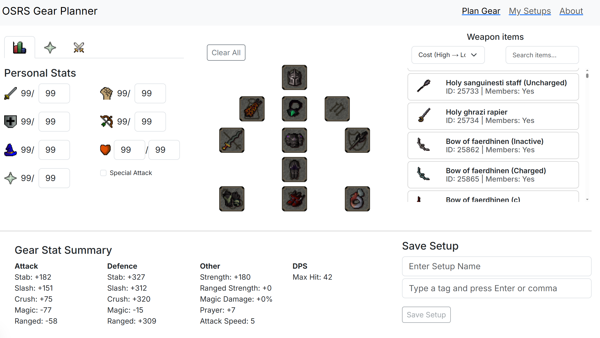
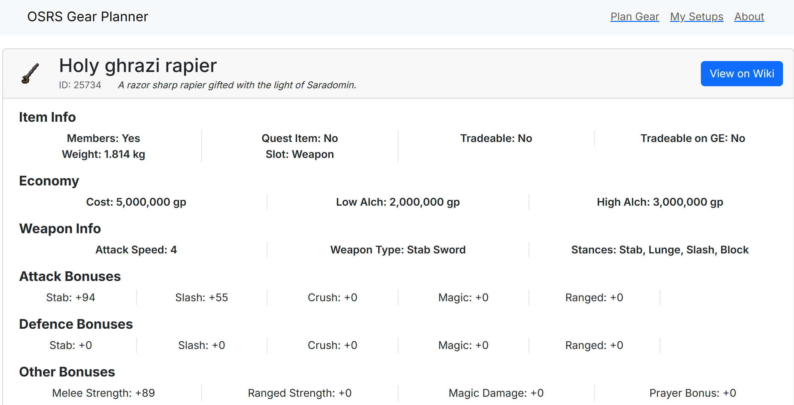

# 🛡️ OSRS Gear Planner

> A web-based tool for building, testing, and saving gear setups in Old School RuneScape (OSRS).

## 🧠 Highlights

-   ⚔️ Real-time stat and max hit updates while changing gear
-   💾 Save & load named setups with optional tags
-   🔍 View detailed item stats on a dedicated item page
-   ⚡ Fast, responsive interface built in React with Next.js
-   🧠 Flexible max hit calculator with support for custom bonuses
-   📦 Full-stack with MongoDB backend (via Next.js API routes)
-   🔐 Runs locally with no login or data sharing required

## ℹ️ Overview

The OSRS Gear Planner is a full-stack web app that lets players of Old School RuneScape experiment with different gear setups and instantly see their effects on combat stats and max hit.

Whether you're prepping for a raid, optimizing your magic gear, or comparing prayer bonuses, the planner gives instant visual feedback. It’s built to be fast, flexible, and user-friendly, with future support planned for more advanced mechanics like potion boosts and PvP modifiers.

## Why this project?

I built this as my capstone project while studying web development. As a casual OSRS player, I was always hearing more experienced friends talk about gear optimization. I realized there were tools out there—but I wanted to learn by making one from scratch, and ideally impress those same friends with something useful and polished.

## Screenshots

Gear Planner


Item Details Page


## ✍️ Author

Hi, I’m James Pagliaccio, a developer with a passion for building interactive tools that solve real-world problems. You can view more of my work on GitHub.

This was my first full-stack project using Next.js, and it taught me a lot about planning, scaling logic, and balancing ambition with deliverables.

## Usage Instructions

> ✅ Minimum requirements: Node.js 18+, MongoDB running locally

1. Clone the repository:

```bash
git clone https://github.com/your-username/osrs-gear-planner.git
cd osrs-gear-planner
```

2. Install dependencies:

```bash
npm install
```

3. Setup environment variables for MongoDB (see /my-capstone-app/src/lib/dbConnect.js), local MongoDB needed for data.
   Dataset can be found at https://github.com/0xNeffarion/osrsreboxed-db.git or follow MongoDB setup below.

> 💡 This project currently runs locally. Deployment options like Vercel or Railway were explored but not completed due to time constraints.

4. Run the development server:

```bash
npm run dev
```

5. Open http://localhost:3000 to use the app.

## MongoDB Setup and Item Data Seeding

This app requires a local MongoDB database seeded with item data from the OSRS game.

1. Ensure MongoDB is running locally.
2. Transform and import the data using a custom script:
   I wrote a script in a separate repo to filter and restructure this data into a format suitable for this app’s backend.

    > 🔗 You can find that script here:
    > https://github.com/JamesP-GitH/JP-IOD-MiniProject3/tree/main/miniproject-mongodb-app in the /dbimporters/ folder, based on models in the /models/ folder.
    > The raw JSON files are also included in this repository, or can be sourced from https://github.com/0xNeffarion/osrsreboxed-db.git
    > The script:

    - Removes unused fields
    - Normalizes equipment stats and slot data
    - Ensures consistency with frontend expectations
    - Seeds the local MongoDB database with cleaned item data

3. Add your environment variable:
   Create a .env file in the root of the project with the following line:

    ```bash
     DB_URI=mongodb://localhost/osrsgearplanner
     PORT=8080
    ```

    The database connection is handled via src/lib/dbConnect.js. With line 3 needing to be changed to:

    ```js
    const uri = process.env.DB_URI || "mongodb://localhost/osrsgearplanner";
    ```

4. Run Node script to seed MongoDB:
   Import script name needs to be changed and rerun for each gear slot, as they use seperate importers and models for each.
    ```bash
    node .\dbimporters\importscript.js
    ```

## 💬 Feedback and Contributions

If you found this project useful or have suggestions, feel free to:

-   ⭐ Star this repo
-   🐛 Open an issue
-   🤝 Fork and contribute!

Pull requests are welcome. For major changes, please open an issue first to discuss what you'd like to change.

## 🗂 References

[OSRS Item & Monster DB (via community API)](https://github.com/0xNeffarion/osrsreboxed-db.git)
